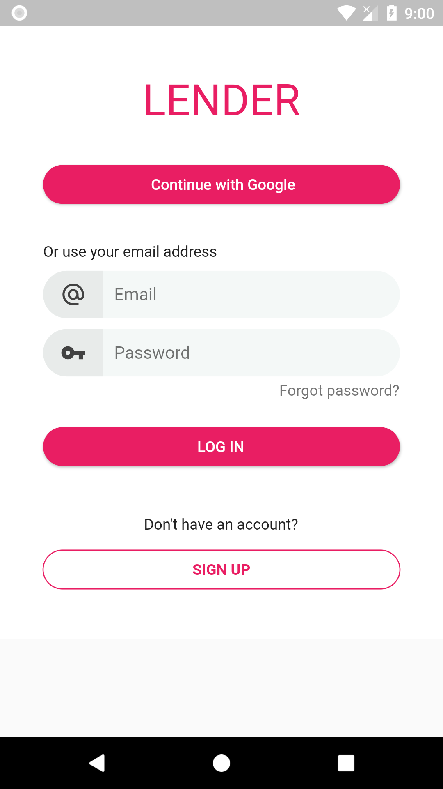
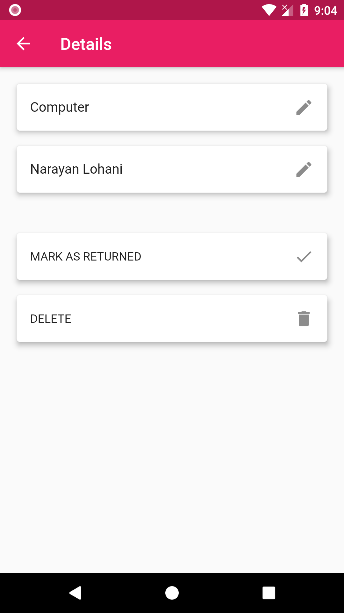
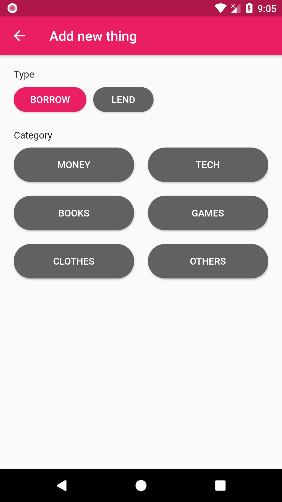
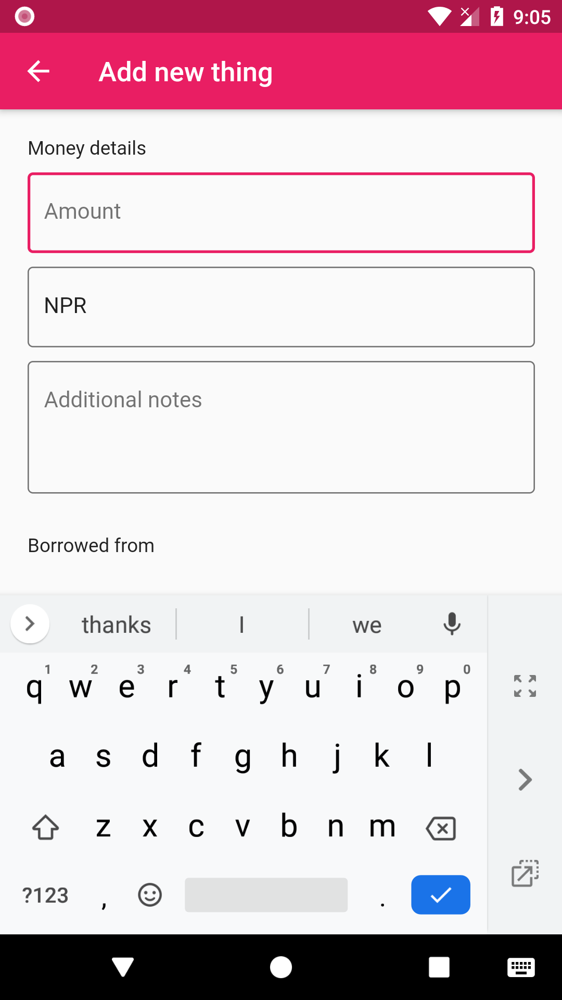

# Lender
An application to keep track of items you borrow and lend.

## Screenshots
      

## Tech stack
- Flutter SDK
- Firestore for storing data
- Firebase Auth for authentication
- BLoC architecture